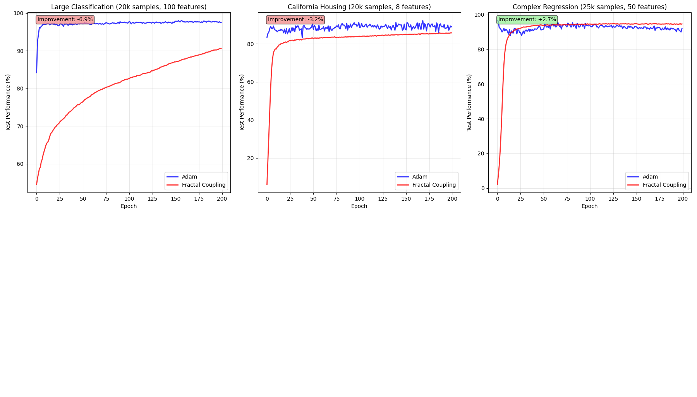

# Fractal Optimizer



🌊 **Fractal Gradient Coupling Optimizer**

This project implements a novel optimizer that injects fractal 1/f^β noise into gradient descent steps. It is designed to explore whether continuous, scale-invariant stochasticity can outperform or enhance traditional optimizers like Adam.

## Features

- Fractal noise injection based on 1/f^β distributions
- Works with regression and classification datasets
- CUDA acceleration support
- Comparison between Adam and Fractal optimizers

## Results Summary

| Task                   | Fractal Win? | Notes                                   |
|------------------------|--------------|-----------------------------------------|
| Large Classification   | ❌           | Promising but underperforms Adam        |
| California Housing     | ❌           | Close, but slightly below Adam          |
| Complex Regression     | ✅           | Outperforms Adam by ~2.7%               |

## Usage

```bash
python fractal_optimizer.py
```

Make sure you have `torch`, `scikit-learn`, and `numpy` installed.

## License

MIT License
